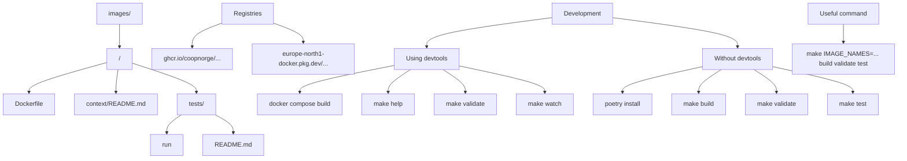

# engineering-docker-images

## Layout

Dockerfiles for images are all located in the `images/` directory. Each image
has a subdirectory from which it's name will be derived.

## Registries

Docker images are published to the following registries:

- `ghcr.io/coopnorge/engineering-docker-images/e0/${image_name}:latest`

  This is mainly for easy usage from GitHub, once it is easier to setup
  workload identity we can remove this.

- `europe-north1-docker.pkg.dev/engineering-production-af50/images/${image_name}:latest`

  This is org readable for coop.no.

## Developing

### Image Tests

To tests images, the run file inside the image's test directory will be
executed, for example, to test the `devtools-golang-v1beta1` image, the
`images/devtools-golang-v1beta1/tests/run` file will be executed. This file can
run any test framework.

Each image should have a `README.md` in its `tests` directory that provides
some additional testing instructions, e.g.
`images/devtools-golang-v1beta1/tests/README.md`.

### Using images while developing

Images should have a `README.md` file inside their `context` directories with
instructions on how to use the images during development, e.g.
`images/devtools-golang-v1beta1/context/README.md`.

### Using devtools

```bash
# build images
docker compose build
# see available targets
docker compose run --rm devtools make help
# validate
docker compose run --rm devtools make validate VERBOSE=all
# run in watch mode
docker compose run --rm devtools make watch
```

### without devtools

```bash
poetry install
make build validate test
```

### Useful commands

```bash
# run tests for only one image
make IMAGE_NAMES=devtools-terraform-v1beta1 build validate test
```



