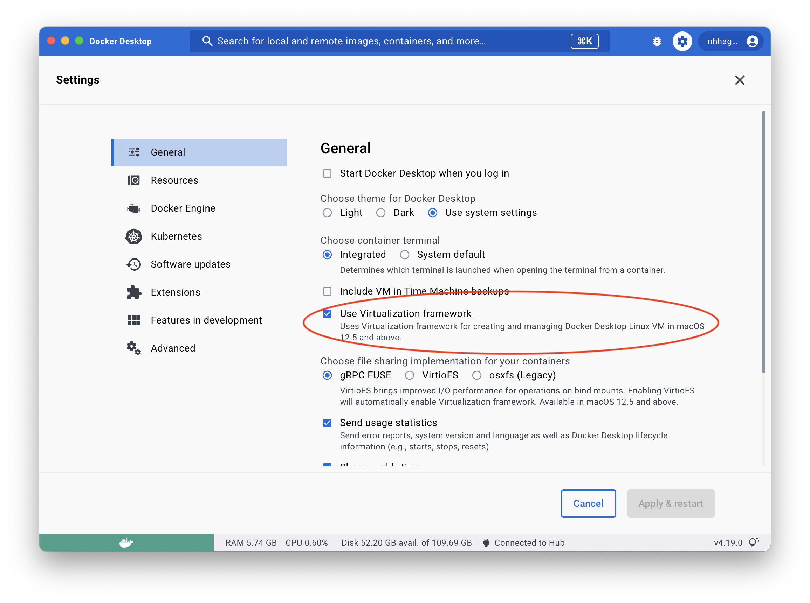
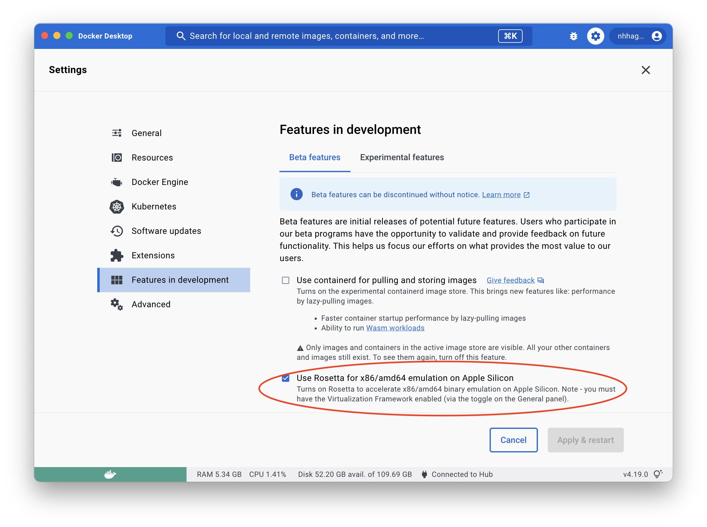

# Engineering Docker Images

## Images

### devtools

devtools images are intended for use in git repos to do validation and artifact building.

#### Security Considerations for devtools

!!! warning
    The devtools images should only be used with rootless docker or similar
    technologies.

devtools images are designed to be used with [rootless
docker](https://docs.docker.com/engine/security/rootless/), as they have to be
able to modify files on filesystem as the user that invokes them. One example
of this is when they have to enforce fixing validation errors (i.e.
`validation-fix` target), but this is also the case when they have to maintain
state across invocations like inside `.terraform`.

With rootless docker, all files of the user that runs the image is seen to the
container as root, and the root user in the docker container translates to the
invoking user. It is possible to assign non root ownership to files mounted
into the container but these permissions are not persisted as there is no place
for this permission to be persisted to, and the next time the same files are
mounted into a container they will again just have root permission.

To accomodate this situation default user of the containers is root, and using
them with a different user than root will likely only work in very select and
limited situations where they don't have to modify anything on disk. If these
containers run with rootless docker this  does not present the same security
risks as those presented by using the root user with docker daemon running as
root, as there is no potential for privilige escalation beyond the priviliges
of the invoking user, which is the exact privliges which the process in the
docker container should have anyway in order to operate as intended. This being
said, care should be taken to not use these images with a docker daemon that is
running as root.

### Usage

!!! note "Docker Desktop on Apple Silicon"
    For certain images to function property x86/amd64 emulation using Rosetta 2
    must be enabled.

    1. Go into the Docker Desktop settings.
    2. In "General" enable "**Use Virtualization framework**".
       
    3. In "Feature in development section" enable "**Use Rosetta for x86/amd64
       emulation on Apple Silicon**".
       

### Dockerfile for referencing the Engineering Docker Images

`/docker-compose/Dockerfile` is used to reference Engineering Docker Images.

### Depandabot image update configuration

To use Dependabot to keep the Engineering Docker Images in your repository up
to date. Add the following to the repository Dependabot configuration
file.

```yaml title=".github/dependabot.yaml"
---
version: 2

registries:
  coop-ghcr:
    type: docker-registry
    url: ghcr.io
    username: CoopGithubServiceaccount
    password: ${{ secrets.DEPENDABOT_GHCR_PULL }}

updates:
  - package-ecosystem: "docker"
    directory: "/docker-compose"
    schedule:
      interval: "daily"
    registries:
      - coop-ghcr
```
